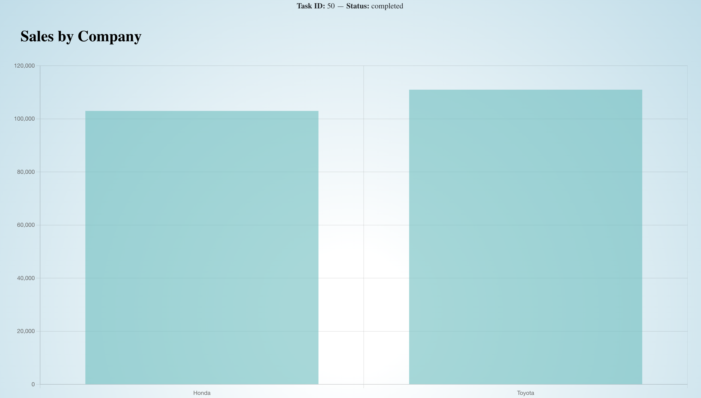
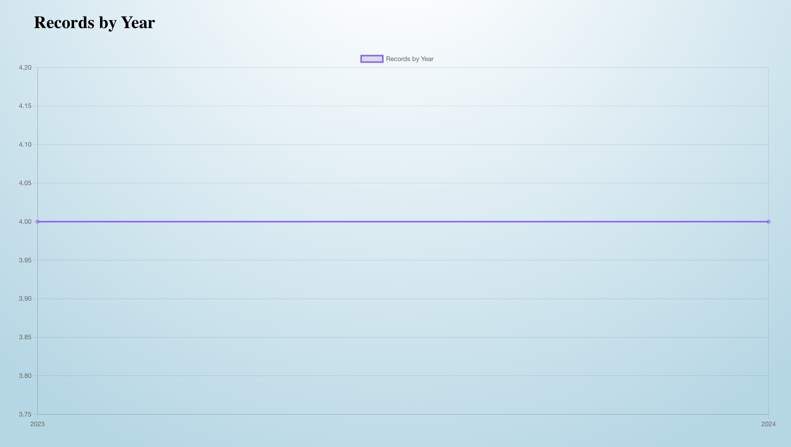

# Car Sales Analytics

A full-stack web application to process, filter, and visualize car sales data using Flask (backend) and React (frontend) with Chart.js.

---

## Demo Preview

## Tech Stack

- **Frontend:** React, Chart.js
- **Backend:** Python, Flask, SQLAlchemy
- **Data:** JSON + CSV (combined and filtered)
- **Database:** SQLite

---

## Features

- Submit a task with filters (year range, companies)
- Backend queues and processes records in the background
- Chart displays total sales by company (bar) and year (line)
- Live task polling (status: pending → in progress → completed)

---

## Setup Instructions

### Backend Setup
cd backend : 

python app.py

### Frontend Setup
cd frontend:

npm start

### API Endpoints
POST /tasks → Submit filters and create a task

GET /tasks/<task_id> → Get task status

GET /analytics/<task_id> → Get processed analytics data

### UI Features

Input filters: start year, end year, company names
Task ID + live status tracking
Bar Chart: Total sales by company
Line Chart: Sales records by year

